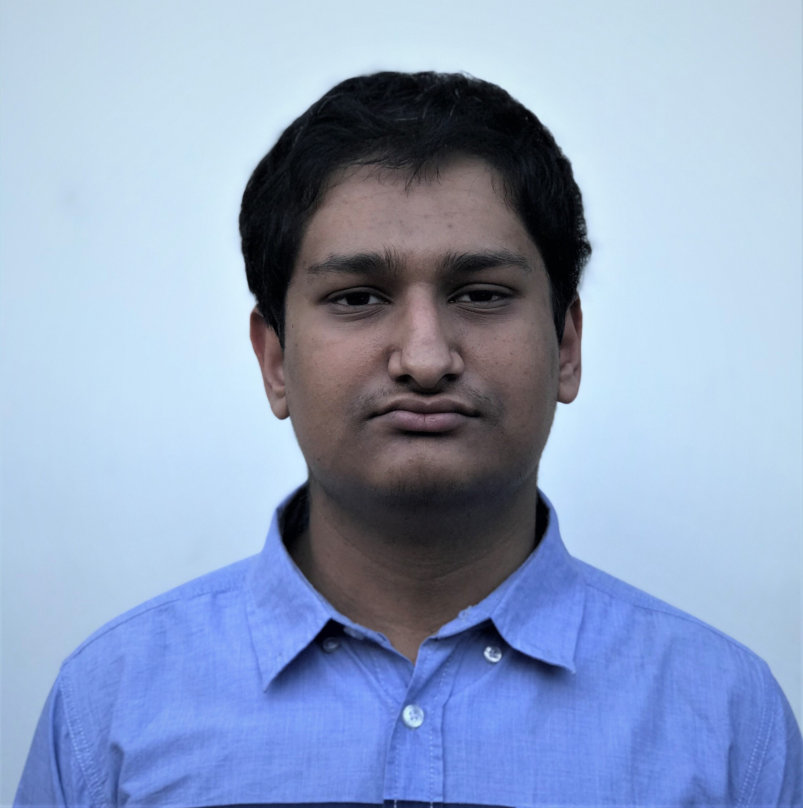

# About Me
My name is Suhaib Chowdhury. I am a Math-CS major. I transferred to UCSD last year. Hopefully this will be my last quarter here. I am originally from Fresno. I have been programming on and off for quite a few years at this point. I first got interested in game development at about 11 years. I did not get serious about programming until high school though. You can see more about my skills in [**An Informal Resume**](#an-informal-resume). My main interest with computer science is in networking. I want to get into network programming. I also had an interest in machine learning ever since I first learned about it. We will have to wait and see if it sticks around.

Here is a not so flattering photo of me. 



My philosophy these past couple of years is based on this quote often incorrectly attributed to [Mark Twain](https://marktwainstudies.com/the-apocryphal-twain-i-have-never-let-schooling-interfere-with-my-education/):
> I have never let my schooling interfere with my education.

I choose to interpret this as focusing on actually learning rather than letting worrying about grades. I will still try to get good grades, but I won't try to maximize my grades only to not end up learning anything. I want my grade to be a representation of my actual skill and not something I prop up. I think that the current state of computer science education is not good for teaching student how to succeed in the workplace, which is why we have this class (I want to point out I have zero industry experience, so I may be completely wrong about this). I want to get good at what I do. 

I have been spending a lot of time learning advanced programming skills. I recognize that I am far from being great, but I believe that I can get there. Here is some code from a personal project I am working on. It initializes a chess board from a [FEN String](https://en.wikipedia.org/wiki/Forsyth%E2%80%93Edwards_Notation). I hope its needless complexity will impress you.
```
Board::Board(std::string fen_string_pieces) {
	boards = {0,0,0,0,0,0,0,0};
	auto piece_map = std::unordered_map<char, int> {{'P', 2}, {'N', 3},{'B', 4},{'R', 5},{'Q', 6},{'K', 7}};
	auto square = 56;
	for (int i = 0; i < fen_string_pieces.size(); i++) {
		// We should be at the end of the rank, so go to beginning of next rank
		if (fen_string_pieces.at(i) == '/') {
			square -= 16;
		} 
		// If current char is number, then move forward by that many squares
		else if (fen_string_pieces.at(i) >= 49 && fen_string_pieces.at(i) <= 57) {
			square += (fen_string_pieces.at(i) - 48);
		}
		// Alphabetical character, we have a piece
		// We will do white first
		else if (fen_string_pieces.at(i) >= 65 && fen_string_pieces.at(i) <= 90) {
			boards[0] = boards[0] + (1ULL << square);
			boards[piece_map[char(std::toupper(fen_string_pieces[i]))]] =
				 boards[piece_map[char(std::toupper(fen_string_pieces[i]))]] + (1ULL << square);
			square++;
		}
		// The piece should be black
		else {
			boards[1] = boards[1] + (1ULL << square);
			boards[piece_map[char(std::toupper(fen_string_pieces[i]))]] =
				 boards[piece_map[char(std::toupper(fen_string_pieces[i]))]] + (1ULL << square);
			square++;
		}
	}
}
```

## Interests
I like reading. I haven't had much time to read but at this moment I have read 129 books. I'm not sure if it is a lot. I know this number will be impressive to people who don't read books, but I know for avid readers this may be a bit low. My favorite book is _The Final Empire_ by Brandon Sanderson. I which I had something a bit more interesting to have as my favorite, but that is something I am aiming to fix.

I have also recently gotten myself into the world of film snobbery last year. I haven't gotten to the point where I can only enjoy absurdist Romanian movies from the 50s (but I'll probably get there). Here are my top favorite (not what I think are the objective best) 10 movies:
1. Inception
2. Fantasitc Mr. Fox
3. Whiplash
4. No Country for Old Men
5. 2001
6. The Thing
7. City of God
8. Sprited Away
9. The Silence of the Lambs
10. Chinatown  

# An Informal Resume
I was a Computer Science major at Fresno State. I was there starting at 2020 to 2022 when I transferred to UCSD. I am a Math-CS major here. Here are some of the courses I have taken:
- Data Structures and Algorithms
- Mathematical Statistics
- Computer Systems (ARM, x86, and MIPS)
- Intro to Data Science
- Numerical Linear Algebra

Here are some of my skills:
- C++ (Intermediate)
    -  Made a simulation of a MIPS processor
- Java (Intermediate, has been a while since I last used it)
- Python (Intermediate)
    - Used pandas and analyze datasets for a project and made machine learning models with scikit-learn to make prediction models.  
- C# (Intermediate)
    - Made a custom 3D renderer that renders wireframes using prospective projection using WPF.
- JavaScript (Beginner)

# Goals for the Quarter
I'm not sure what to do about he task list so here is a list of things I want to learn this quarter. It's a bit much and I don't think I will be able to do most of it, but I think the ambition will push me to do more.
- [ ] C++
- [ ] JavaScript
- [ ] Rust
- [ ] Networking
- [ ] Advanced Python
